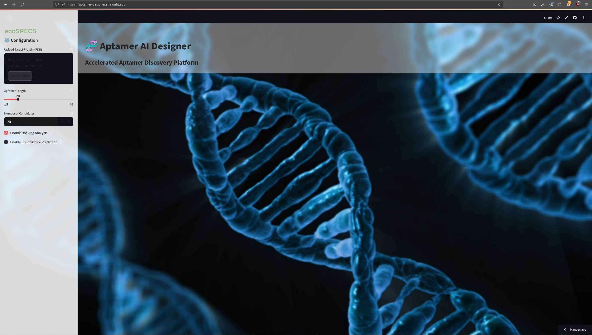
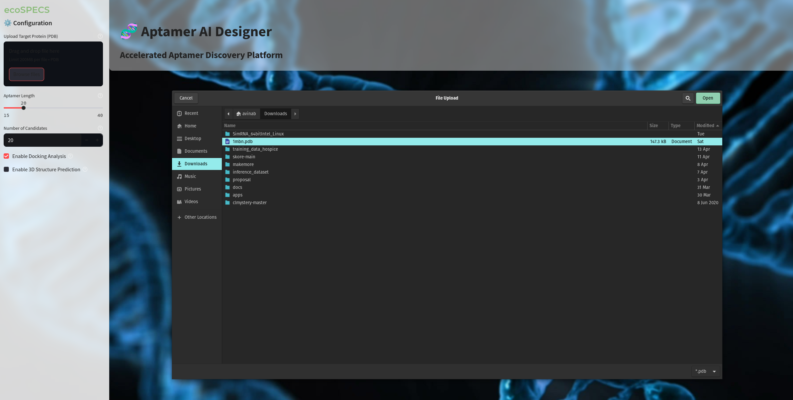
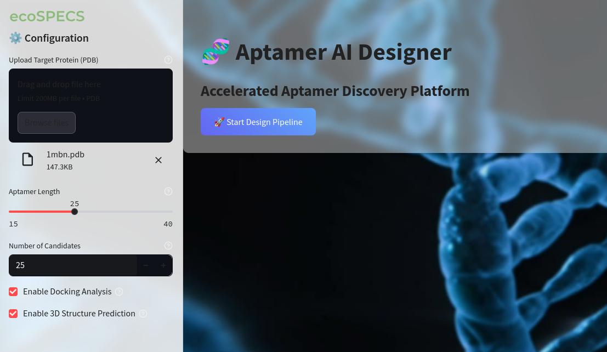
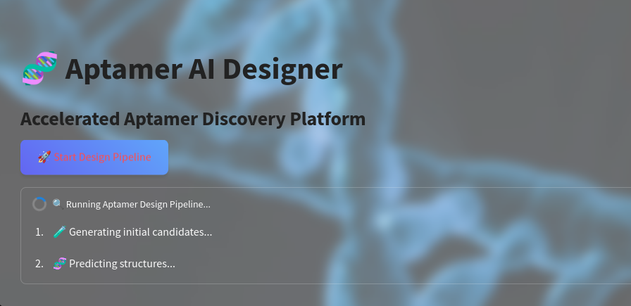
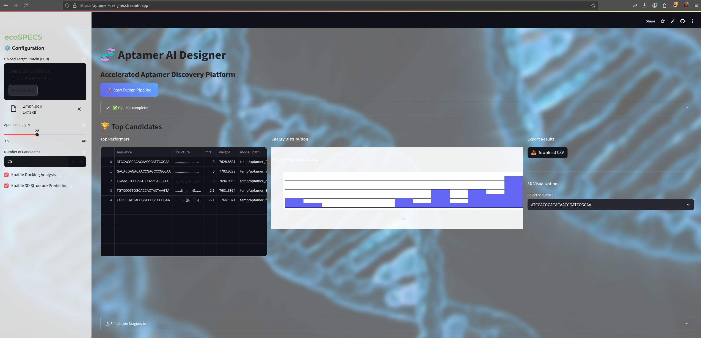

# Aptamer AI Designer

**Live demo:** [aptamer-designer.streamlit.app](https://aptamer-designer.streamlit.app/)

Aptamer AI Designer is an open-source web app for rapid, in-silico aptamer design. It combines AI-driven candidate generation, structure prediction, and molecular docking in a user-friendly interface.

---

## Features

- Upload a target protein (PDB file)
- Configure aptamer length and number of candidates
- Automated aptamer sequence generation and structure prediction
- Visualize energy distribution of candidates
- Download top candidates as CSV

---

## Screenshots

### 1. Landing Page / App Home
Shows the title, branding, and general look.

---

### 2. Upload Step
Shows the file uploader with a PDB file selected.

---

### 3. Parameter Configuration
Shows sliders/inputs for aptamer length and number of candidates.

---

### 4. Pipeline Running
Shows the progress/status bar.

---

### 5. Results Summary
Shows the "Top Candidates" table and the energy distribution plot.

You can download the results in csv format by clicking the `Download CSV` button

---

